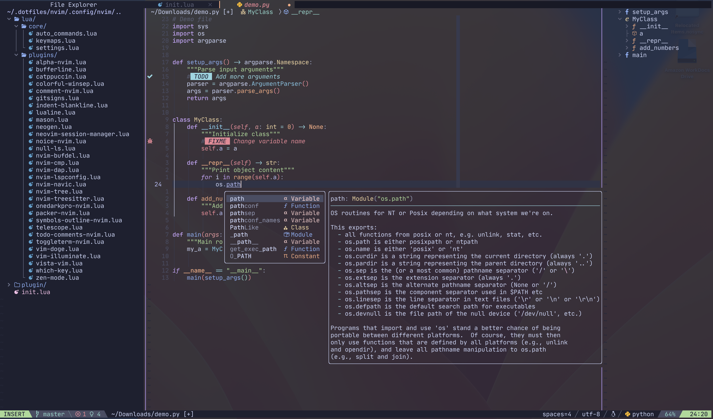
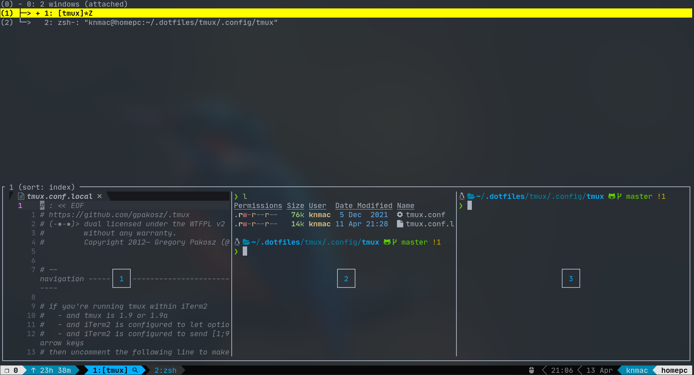
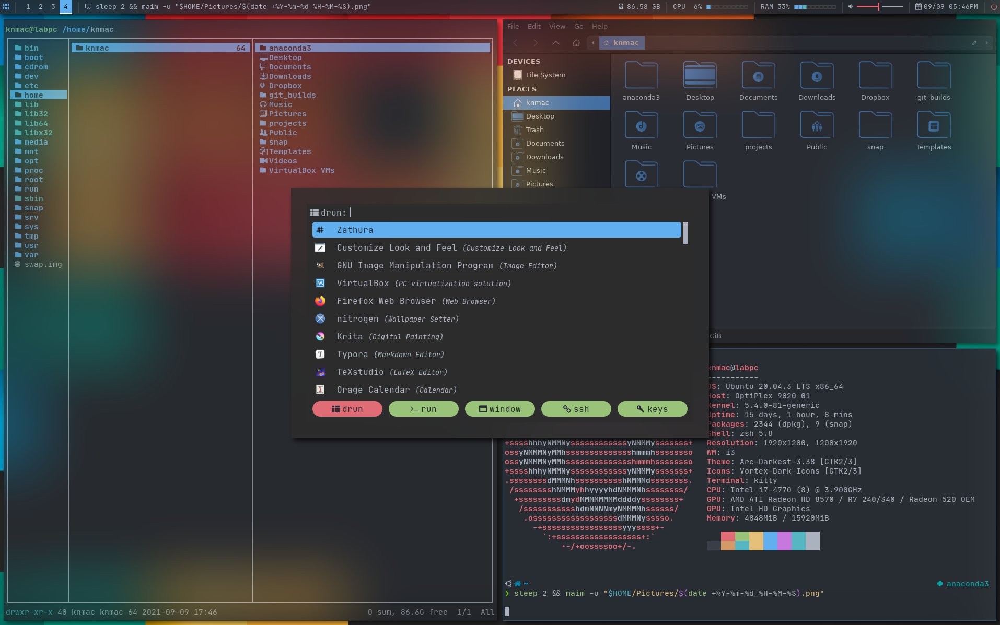

# Dotfiles

Some linux configurations I have been collecting.

## 1. Prerequisite

### 1.1. Stow

Install `stow` to manage the config files. The `stow` commands are added to my installation scripts.

```bash
sudo apt install stow
```

### 1.2. Fonts installation

This is to display glyphs and breadcrumbs for Neovim and Tmux correctly. Visit [here](https://www.nerdfonts.com/#home) for more information.


```bash
./installation/install_fonts.sh
```

You then need to configure the font for your preferred terminal manually.

## 2. ZSH

### 2.1. Installation

```bash
./installation/install_zsh.sh
```

You may need to log out and log in again to update your default shell.

## 3. NeoVim



### 3.1. Installation

Install NeoVim dependencies, this will install `nodejs` for you, too:

```bash
./installation/install_nvim.sh
```

### 3.2. Cheatsheet

[Neovim cheatsheet](cheatsheets/nvim_cheatsheet.md)


## 4. Tmux



### 4.1. Installation

You can install tmux with sudo:
```bash
sudo apt install tmux
```

Or build from source:
```bash
./installation/install_tmux.sh
```

The configuration is customized from [here](https://github.com/gpakosz/.tmux).

### 4.2. Cheatsheet

[Tmux cheatsheet](cheatsheets/tmux_cheatsheet.md)

## 5. Window manager



[TODO]

## 6. Some other tools that I use

- Terminal: `kitty`
- File manager: `ranger-fm` (with `ueberzug` for image preview method)
- List contents in tree-like format: `tree`
- File searcher: `rg` (ripgrep - improved version of `grep`)
- File preview with syntax highlighting: `bat`
- Interactive process viewer: `htop`, `bpytop`
- Bandwidth monitor and rate esimator: `bmon`
- System info viewer: `neofetch`
- Document converter: `pandoc`
- Video converter: `ffmpeg`
- Web browser and pager: `w3m`
- Email client: `neomutt`
- Music player client: `cmus`, `ncmpcpp`, `mpd`, `mpc` [moreinfo](https://computingforgeeks.com/how-to-configure-mpd-and-ncmpcpp-on-linux/)
- Music visualizer: `cava`
- PDF reader: `zathura`
