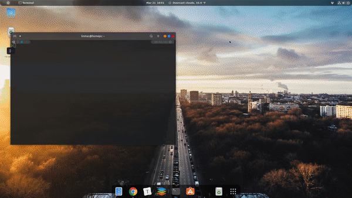

# Linux settings

Some linux settings I have been collecting.
<p align="center">
  
</p>


## 0. Fonts configuration (Optional)

This is to display glyphs and breadcrumbs for Neovim and Tmux correctly. Visit [here](https://www.nerdfonts.com/#home) for more information. My favorite ones are [FiraCode](https://github.com/tonsky/FiraCode/releases/download/2/FiraCode_2.zip) and [SauceCode Pro](https://github.com/ryanoasis/nerd-fonts/releases/download/v2.1.0/SourceCodePro.zip) (also included in `fonts` directory).

```bash
mkdir -p ~/.local/share/fonts
cp ./fonts/* ~/.local/share/fonts
```

You then may have to configure the font for your preferred terminal manually.

## 1. Auto installation (required sudo)

This is to install everything automatically. However, I recommend to open the installation files and execute only necessary sections. Some installation guides are also given here.

Installation:

```bash
git clone https://github.com/knmac/linux_settings.git
cd linux_settings
sudo sh ./install_auto.sh
```

## 2. NeoVim

### 2.1. Installation

Install NeoVim dependencies:

```bash
sudo apt install python3-dev python3-pip curl exuberant-ctags shellcheck
pip3 install --user pynvim neovim flake8 msgpack
```

[Optional] Install NodeJS (locally) for Coc.nvim. Change the URL accordingly. See [this](https://github.com/neoclide/coc.nvim) for more information about Coc.

If you do not want to use Coc and NodeJS, change the variable `use_coc` to 0 at the beginning of `init.nvim` and ignore this step.

```bash
wget https://nodejs.org/dist/v12.18.3/node-v12.18.3-linux-x64.tar.xz
tar xvf node-v12.18.3-linux-x64.tar.xz
rm node-v12.18.3-linux-x64.tar.xz
mv tar xvf node-v12.18.3-linux-x64.tar.xz ~/.local
export PATH="$HOME/.local/node-v12.18.3-linux-x64/bin:$PATH" >> ~/.zshrc
```

Install NeoVim with my configuration:

```bash
sudo add-apt-repository ppa:neovim-ppa/stable
sudo apt update
sudo apt install neovim
mkdir -p "$HOME/.config/nvim"
cp -r nvim/* "$HOME/.config/nvim"
nvim
```

If you see this error (usually seen when run neovim in a virtual environment):
`[deoplete] deoplete failed to load. Try the :UpdateRemotePlugins command and restart Neovim. See also :checkhealth.`. 
Follow these steps:

1. Install/upgrade some packages:
```bash
pip install --user --upgrade pynvim
pip3 install --user --upgrade pynvim
```
2. Then open Neovim and run:
```
:UpdateRemotePlugins
```

### 2.2. Cheatsheet

[Neovim cheatsheet](nvim_cheatsheet.md)


## 3. Tmux

### 3.1. Building from source

Change the versions, URLs, and paths accordingly in `install_tmux.sh`. The configuration is customized from [here](https://github.com/gpakosz/.tmux).

Then add these two lines in your `.bashrc` or `.zshrc`:

```bash
export PATH="$HOME/.local/bin":$PATH
export LD_LIBRARY_PATH="$HOME/.local/lib":$LD_LIBRARY_PATH
```

### 3.2. Cheatsheet

[Tmux cheatsheet](tmux_cheatsheet.md)

## 4. Some other tools that I like

(You may look in `others` directory for more information about my configuration.)

- Terminal: `kitty`
- File manager: `ranger-fm` (with `ueberzug` for image preview method)
- List contents in tree-like format: `tree`
- File searcher: `rg` (ripgrep - improved version of `grep`)
- File preview with syntax highlighting: `bat`
- Interactive process viewer: `htop`
- Bandwidth monitor and rate esimator: `bmon`
- System info viewer: `neofetch`
- Document converter: `pandoc`
- Video converter: `ffmpeg`
- Web browser and pager: `w3m`
- Email client: `neomutt`
- Music player client: `ncmpcpp`, `mpd`, `mpc` [moreinfo](https://computingforgeeks.com/how-to-configure-mpd-and-ncmpcpp-on-linux/)
- PDF reader: `zathura`
